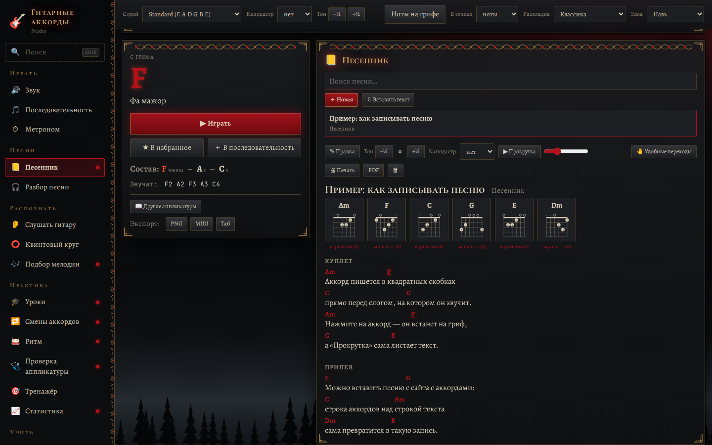

# Гитарные аккорды — Studio

Вторая редакция программы «Гитарные аккорды» с другой архитектурой и 12 новыми функциями. Первая редакция лежит рядом в
`guitar-chords/` и не менялась; обе программы можно установить одновременно (разные имена и идентификаторы).



## Что нового по сравнению с первой редакцией

| Функция | Где | Что делает |
| --- | --- | --- |
| **Песенник** | Песни → Песенник | Песни с аккордами над текстом (формат ChordPro: `[Am]Вот новый [F]поворот`), поиск, транспонирование, каподастр, автопрокрутка. Клик по аккорду — на гриф. Вставка песни с сайта: строка аккордов над строкой текста сама превращается в разметку |
| **Разбор песни → песенник** | Разбор песни | Кнопка «В песенник»: аккорды по тактам (по 4 такта в строке) + заготовка для слов |
| **Смены аккордов** | Практика | Упражнение «одна минута»: пара аккордов (C ⇄ G, Am ⇄ F…), микрофон считает чистые смены, рекорд для каждой пары |
| **Ритм** | Практика | Метроном + микрофон: насколько каждый удар раньше или позже щелчка, точность в мс, четверти или восьмые, поправка на задержку микрофона |
| **Замедление и повтор A–B** | Разбор песни | Скорость 50–100 % без изменения высоты, повтор выбранного куска |
| **Без вокала / только бас** | Разбор песни | Обработка звука: вычитание центра стерео (вокал), выделение или удаление баса |
| **Подбор мелодии** | Распознать | Сыграйте или напойте мелодию — ноты и табулатура для гитары (ноты раскладываются по струнам рядом друг с другом) |
| **Проверка аппликатуры** | Практика | Сыграйте аккорд, стоящий на грифе: какая струна звучит чисто, какая глушится, какая звенит лишняя, какая нота звучит вместо нужной |
| **Своя аппликатура в песне** | Песенник | Для каждого аккорда песни — выбор варианта; «Удобные переходы» подбирают аппликатуры так, чтобы рука меньше двигалась |
| **Статистика занятий** | Практика | Минуты по дням (график за 2 недели), серия дней подряд, выученные аккорды (5 чистых повторов с гитары), рекорды |
| **Печать и PDF** | Песенник | Печатная версия песни: чёрным по белому, со схемами аккордов; PDF сохраняется через главный процесс Electron |
| **Уроки по шагам** | Практика | «Первые 8 аккордов», «Баррэ за неделю», «Бой шестёрка» — каждый шаг проверяется микрофоном |

Плюс: **поиск по всему (Ctrl+K)** — разделы, песни, аккорды («Am7» → на гриф), темы и раскладки.

Всё из первой редакции осталось: гриф, определение аккордов, звук, MIDI, справочник, гаммы, тональность, последовательность,
метроном, «Слушать гитару», квинтовый круг, разбор песни, тюнер, тренажёр, избранное, 7 тем и 3 раскладки (на телефоне — своя).

## Архитектура

| | Первая редакция (`guitar-chords/`) | Studio (`guitar-chords-studio/`) |
| --- | --- | --- |
| Состояние | Хуки + React-контекст (`AppContext`), у каждой части своё `localStorage` | Одно хранилище Zustand из срезов, сохраняется одним ключом со схемой версий |
| Разделы | Панели получают данные пропсами из общего реестра `panels.tsx` | Модули: папка + манифест `{ id, title, icon, group, View }`; меню, поиск, плитки и окна строятся по реестру |
| Микрофон | Каждая функция открывает свой поток | Общий сервис `mic`: один поток, счётчик пользователей |
| Связи между разделами | Колбэки через контроллер | Шина событий: `chord:heard`, `mic:onset`, `metronome:beat` |
| Побочные эффекты | Внутри хуков | Сервисы (`services/`): распознавание, метроном, секвенсор, MIDI, экспорт, печать |
| Проверка логики | Только чистые функции `core/` | Плюс хранилище целиком — без интерфейса (`tests/store.test.ts`) |

```
src/
  core/        чистая логика: музыка, анализ звука, песенник (ChordPro, автоподбор), практика (ритм, статистика)
  store/       хранилище: срезы settings, guitar, collections, songbook, practice, runtime + производные данные грифа
  services/    побочные эффекты: mic, chordListener, metronome, sequencer, midi, bus, exports, print, wiring
  modules/     разделы-модули (20 шт.) и их реестр registry.ts
  shell/       оболочка: меню, верхняя панель, гриф, карточка аккорда, 4 раскладки, поиск Ctrl+K, «О программе»
  ui/          общие визуальные компоненты: гриф, диаграмма аккорда, квинтовый круг, пианино
```

Зависимости идут сверху вниз: `shell → modules → services → store → core`. Модули не импортируют друг друга
(общее — через хранилище и шину), `services/wiring.ts` — единственное место, где одно событие связывает несколько частей.

## Запуск и сборка

```bash
npm install
npm run dev          # разработка
npm run check        # типы + тесты + форматирование
npm run dist:win     # установщик и portable для Windows (release/)
```

Автообновлений у Studio нет — новая версия ставится поверх вручную.

## Android

Та же программа, упакованная в Capacitor (папка `android/`). APK собирается в GitHub Actions
(артефакт **GuitarChordsStudio-Android**). Локально, если установлен Android SDK:

```bash
npm run android:sync          # сборка веб-части и копирование в android/
cd android && ./gradlew assembleDebug
```

На узком экране включается раскладка для телефона: меню выезжает по кнопке ☰, настройки грифа — по ⚙,
гриф крупный и листается пальцем. Микрофон запрашивается при первом включении слушания.
Пока не работают на телефоне: MIDI-клавиатура, печать/PDF и сохранение файлов экспорта.

## Точность «Слушать аккорд»

- **По струнам** — аккорд зажат, струны щиплются по одной от 6-й к 1-й. Каждая новая нота
  выделяется из звука (прежние струны вычитаются), лад = нота − нота открытой струны. Получается
  точная аппликатура (например, C у порожка и C баррэ на 3-м ладу различаются), на гриф ставится она.
- **Калибровка** — открытые струны по очереди: строй каждой струны и подъём басов, которые
  слабый микрофон «съедает». Хранится в настройках и применяется при слушании.
- **Нейросеть (бета)** — [Basic Pitch](https://github.com/spotify/basic-pitch) (Spotify, Apache-2.0),
  модель лежит в `public/models/basic-pitch`. Считает на видеокарте (WebGL), иначе через WebAssembly
  (~0,2–0,4 с на аккорд), иначе на процессоре. TensorFlow.js подгружается только при выборе движка.
  Сравнение с формулами: `NEURAL_BENCH=1 npx vitest run tests/neural.test.ts`
  (переменные `NEURAL_NOISE`, `NEURAL_BRIGHT`, `NEURAL_PREV`, `NEURAL_BACKEND=wasm`).
