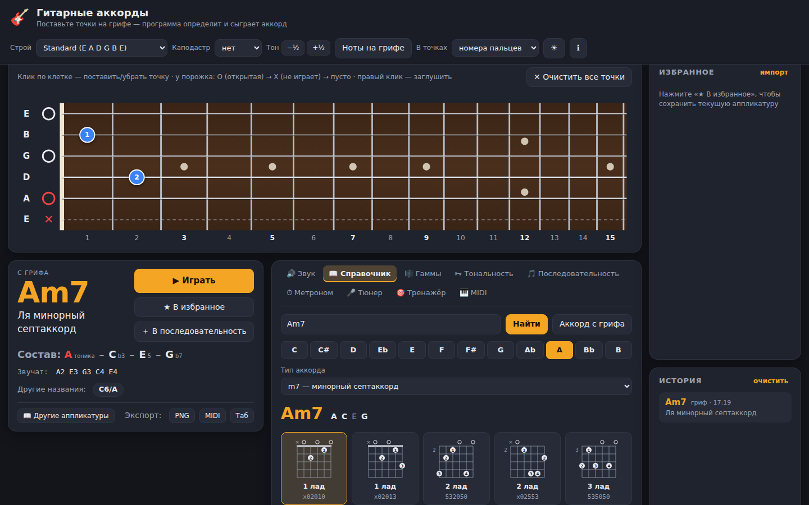
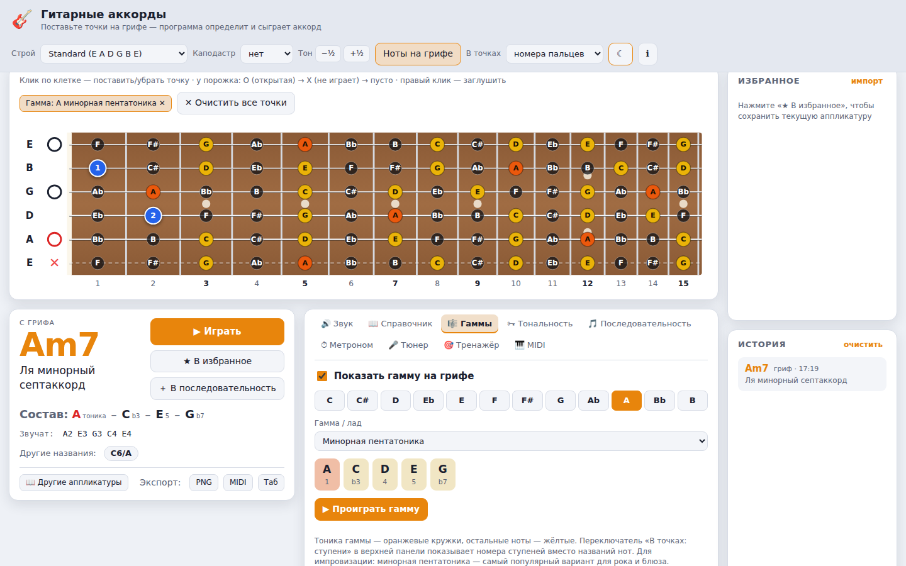

# Гитарные аккорды

Десктопное приложение: интерактивный гриф гитары, определение аккорда по точкам нажатия (или по нотам с MIDI-клавиатуры), буквенное название, русская расшифровка и звучание аккорда.



## Возможности



| Раздел | Что есть |
|---|---|
| **Гриф** | 15 ладов. Клик ставит или убирает точку; на одной струне можно поставить несколько. Отметки у порожка: O (открытая) / X (не играет), правый клик глушит струну. При наведении показывается нота. Режим «Ноты на грифе» подписывает все клетки контрастными метками. В точках можно показывать названия нот, ступени аккорда или номера пальцев (с баррэ) |
| **Строи** | Standard, на полтона ниже, Drop D, Drop C, Open G, Open D, Open E, DADGAD, 7-струнная, свой строй; бас на 4 и 5 струн; укулеле |
| **Каподастр и тон** | Каподастр на 1–12 ладу: программа называет и реальное звучание, и форму («форма G, звучит как A»). Транспонирование на полтона кнопками или стрелками ← → |
| **Определение аккорда** | Около 35 типов аккордов: буквенное название, русская расшифровка, обращения, состав со ступенями, другие названия, «Неизвестный аккорд» с ближайшими вариантами. Подсказка по пальцам и предупреждения о неудобной аппликатуре |
| **Справочник** | Аппликатуры любого аккорда по всему грифу (для любого строя и каподастра) с диаграммами. Поиск по названию: `Am`, `Cmaj7`, `Dm/F`, `F#m7b5`, `Bø`, `G°7`… |
| **Гаммы** | 13 гамм и ладов (мажор, минор, пентатоники, блюзовая, дорийский и другие) — подсветка на грифе и проигрывание |
| **Тональность** | Аккорды тональности с римскими цифрами и функциями (T/S/D), трезвучия и септаккорды, 10 популярных последовательностей |
| **Последовательность** | Цепочка аккордов с длительностями, темп, 7 схем боя и перебора («шестёрка», восьмые, кантри…), по кругу, метроном; экспорт в MIDI и табулатуру |
| **Метроном** | 40–240 ударов в минуту, размеры 2/4–7/4, акцент на первую долю, задание темпа касанием |
| **Слушать** | Играете аккорд на гитаре в микрофон — программа сама замечает удар по струнам, называет аккорд (с процентом уверенности и запасными вариантами), показывает его на грифе и ведёт список сыгранного |
| **Разбор песни** | Перетащите MP3/WAV/OGG/FLAC/M4A — программа найдёт аккорды по времени, тональность, темп и посоветует каподастр для простых форм. Песня играется с подсветкой текущего и следующего аккорда на ленте и на грифе; ошибки можно исправить двойным кликом; экспорт в текст и в «Последовательность» |
| **Тюнер** | Через микрофон: нота, частота, стрелка отклонения в центах, подсказка «подтяните / ослабьте» для ближайшей струны, эталонные ноты |
| **Тренажёр** | «Найди ноту» на грифе, «Построй аккорд» (с проверкой и подсказкой), «Угадай на слух» (3 уровня); счёт и серия |
| **Звук** | Записанные сэмплы гитар: акустика со стальными струнами, нейлон, электрогитара (чистый звук и с перегрузом), бас. Реверберация, громкость, бой вниз и вверх, перебор, «Стоп» |
| **MIDI** | Вход: автоопределение клавиатур, выбор устройства, подсветка нот на грифе, определение аккорда, «Перенести на гриф», экранная клавиатура. Выход: отправка аккордов в DAW или синтезатор |
| **Экспорт** | Аккорд — PNG-диаграмма, MIDI-файл, текстовая табулатура (копируется в буфер). Избранное — экспорт и импорт в JSON |
| **Прочее** | История, избранное, тёмная и светлая тема, автообновление (для установленной Windows-версии), все настройки сохраняются |

Горячие клавиши: **Пробел** — сыграть, **Esc** — остановить звук, **Delete** — очистить гриф, **← →** — транспонировать на полтона, **F12** — инструменты разработчика.

## Архитектура

Стек: **Electron + React + TypeScript + Vite**, звук — Web Audio API, MIDI — Web MIDI API, сборка дистрибутивов — electron-builder.

```
┌──────────── Electron main (electron/main.cjs + preload.cjs) ────────────┐
│  окно · протокол app:// · разрешения MIDI/микрофон · автообновление     │
└───────────────────────────────┬─────────────────────────────────────────┘
                                │ app://bundle/index.html
┌────────────────────── Renderer (React, src/) ───────────────────────────┐
│  App.tsx — состояние: гриф, строй, каподастр, MIDI, настройки           │
│                                                                         │
│  Гриф (SVG) ──► board ──► soundingNotes ──► detectChord ──► ChordDisplay│
│  MIDI-вход / экранная клавиатура ──┘              └──► fingering        │
│  Вкладки: Звук · Справочник (voicings) · Гаммы · Тональность ·          │
│           Последовательность · Метроном · Тюнер (pitch) · Тренажёр · MIDI│
│                                                                         │
│  audio/engine ◄── аккорды, бой, перебор, последовательность, метроном   │
│      └──► сэмплы (public/samples) → эффекты → колонки / MIDI-выход      │
└─────────────────────────────────────────────────────────────────────────┘
```

Логика отделена от интерфейса: всё, что касается нот, аккордов и аппликатур, — это чистые функции в `src/music/`, которые тестируются без браузера.

### Структура проекта

```
guitar-chords/
├── electron/
│   ├── main.cjs               окно, протокол app://, разрешения (MIDI, микрофон), автообновление
│   └── preload.cjs            мост к интерфейсу: версия и обновления
├── public/samples/            сэмплы нот: steel, nylon, electric, bass (FluidR3 GM, CC BY 3.0)
├── src/
│   ├── App.tsx                состояние приложения, вкладки, связи модулей, горячие клавиши
│   ├── music/                 теория без UI (покрыта тестами)
│   │   ├── notes.ts           ноты, написание (C#, Bb), русские названия, интервалы
│   │   ├── tunings.ts         строи гитары, баса, укулеле
│   │   ├── fretboard.ts       модель грифа: точки, O/X, каподастр, транспонирование, MIDI → гриф
│   │   ├── chords.ts          шаблоны и определение аккорда
│   │   ├── chordParse.ts      разбор названий «Cmaj7», «Dm/F»…
│   │   ├── voicings.ts        генератор аппликатур по всему грифу
│   │   ├── fingering.ts       расстановка пальцев, баррэ, предупреждения
│   │   ├── scales.ts          гаммы, аккорды тональности, последовательности
│   │   ├── pitch.ts           высота тона (YIN) для тюнера
│   │   ├── dsp.ts             БПФ, спектр по полутонам, поиск звучащих нот, бас
│   │   ├── chordRecognition.ts аккорд по хромаграмме: шаблоны, уверенность, обращения
│   │   └── songAnalysis.ts    разбор песни: доли, Витерби, тональность, каподастр
│   ├── audio/
│   │   ├── engine.ts          сэмплер, перегруз, реверберация, бой вниз/вверх, MIDI-выход
│   │   ├── pluck.ts           запасной синтез струны (если сэмпл не загрузился)
│   │   ├── transport.ts       точный планировщик ритма
│   │   └── patterns.ts        схемы боя и перебора
│   ├── midi/                  Web MIDI (вход/выход), запись .mid
│   ├── export/                PNG-диаграмма, табулатура, сохранение файлов
│   ├── workers/songWorker.ts  анализ песни в фоновом потоке
│   ├── state/                 сохраняемые настройки, движок последовательности
│   └── components/            гриф, панели вкладок, диаграммы, диалоги
├── harness/                   проверка распознавания на записанных сэмплах (npm run harness)
└── tests/                     vitest: аккорды, аппликатуры, пальцы, гаммы, тюнер, распознавание, разбор песни, MIDI
```

### Как определяется аккорд

1. Из грифа собираются звучащие ноты: все поставленные точки и открытые струны (с каподастром открытая струна звучит на его ладу), кроме заглушённых. Если зажаты клавиши MIDI-клавиатуры, берутся их ноты.
2. Ноты сводятся к высотным классам (0 = C … 11 = B); самая низкая нота — бас. Поэтому любые аппликатуры и обращения одного аккорда распознаются одинаково.
3. Каждая нота по очереди пробуется как тоника; интервалы от неё сравниваются с ~35 шаблонами (мажор, минор, dim, aug, sus2/4, 5, 6, m6, 7, maj7, m7, m7b5, dim7, add9, 9, maj9, m9, 7b9, 7#9, 11, 13…). У шаблона есть обязательные и пропускаемые ступени (например, квинта в септаккорде).
4. Оценка: точное совпадение, бонус за тонику в басу, штраф за пропущенную ступень и небольшой вес популярности аккорда. Поэтому `C E G A` с басом C — это C6, а с басом A — Am7.
5. Если тоника не в басу, название пишется через «/» (C/E) и в расшифровке называется обращение: секстаккорд / квартсекстаккорд для трезвучий, квинтсекстаккорд / терцквартаккорд / секундаккорд для септаккордов.
6. Ноты записываются по ступеням от тоники (Bb – D – F, а не A# – D – F; Adim7 = A – C – Eb – Gb).
7. Если точного совпадения нет — «Неизвестный аккорд» и ближайшие варианты (одна лишняя нота или нет терции/квинты), например `C(+C#)`.

### Распознавание аккордов по звуку

Общая часть (`dsp.ts`): кадр звука → БПФ → спектр по полутонам. Затем итеративно ищутся звучащие ноты: выбирается нота, у которой в спектре сильнее всего представлены её обертоны, её обертоны вычитаются, и так далее. Отдельная проверка не даёт принять 3-ю и 5-ю гармоники низкой струны (квинту и терцию через октавы) за самостоятельные ноты. Бас определяется по сумме обертонов в низком регистре: у низких струн основной тон в записи бывает почти не слышен. Ноты складываются в хромаграмму (какие из 12 нот звучат), и она сравнивается с шаблонами аккордов (косинусная мера, бонус за тонику в басу).

- **Слушать:** удар по струнам — резкий скачок громкости. Через 0,36 с после удара начинается анализ окнами по 0,34 с; результат уточняется, пока аккорд звучит.
- **Разбор песни:** темп и доли — по огибающей атак (динамическое программирование, метод Эллиса); хромаграмма усредняется по долям; цепочку аккордов выбирает скрытая марковская модель (Витерби), поэтому аккорд не «скачет» от доли к доле. Тональность — по профилям Крумхансла. Каподастр — положение, при котором больше всего времени звучат простые открытые формы.

Точность на записанных сэмплах (`npm run harness`, 20 типичных аппликатур, один удар): акустика — 19/20, нейлон — 17/20, чистая электрогитара — 12/20 (у неё очень яркие обертоны). Тестовая песня (Am–F–C–G с басом и ударными) разбирается без ошибок. На реальных миксах с вокалом и обработкой точность ниже; ошибки можно поправить вручную.

### Звук

Каждая нота — отдельный записанный сэмпл (набор FluidR3 GM), поэтому звучание естественное на всём грифе. Правило «одна струна — один голос» работает как на настоящей гитаре: новая нота на той же струне глушит предыдущую. «Бой вниз» играет струны от баса с шагом 16 мс, «бой вверх» — от тонких струн и тише. Цепочка эффектов: перегруз с фильтрами гитарного кабинета (только для электрогитары) → реверберация → компрессор → громкость → лимитер. Если сэмпл не загрузился, нота синтезируется алгоритмом Карплуса — Стронга, так что звук есть всегда.

Сэмплы: FluidR3 GM SoundFont (Frank Wen) в конвертации [midi-js-soundfonts](https://github.com/gleitz/midi-js-soundfonts), лицензия [CC BY 3.0](https://creativecommons.org/licenses/by/3.0/).

## Запуск и сборка

Нужен Node.js 20+ (только для разработки: конечному пользователю ничего устанавливать не нужно).

```bash
cd guitar-chords
npm install
npm run dev        # режим разработки (Vite + Electron с горячей перезагрузкой)
npm test           # тесты
npm run build      # проверка типов и сборка интерфейса в dist/
npm start          # запуск собранного интерфейса в Electron
```

### Дистрибутивы

```bash
npm run dist:win     # Windows: release/GuitarChords-Setup-<версия>.exe (установщик) и GuitarChords-Portable-<версия>.exe
npm run dist:mac     # macOS:   release/*.dmg
npm run dist:linux   # Linux:   release/*.AppImage
```

Каждый дистрибутив включает Electron, поэтому пользователю не нужны Node.js и другие рантаймы. Windows-установщик собирается на Windows (на Linux нужен Wine). GitHub Actions workflow (`.github/workflows/guitar-chords.yml`) запускает тесты и собирает установщики для Windows, macOS и Linux при каждом пуше; результат лежит в артефактах сборки.

### Выпуск версии и автообновление

1. Поднять `version` в `package.json` (например, `1.2.0`) и закоммитить.
2. Создать и отправить тег: `git tag v1.2.0 && git push origin v1.2.0`.
3. CI соберёт дистрибутивы и опубликует их в GitHub Releases.

Установленная Windows-версия проверяет обновления при запуске. Когда выходит новая версия, вверху окна появляется кнопка «Скачать и установить». Portable-версию и macOS-сборку нужно обновлять вручную со страницы релизов.

### MIDI

MIDI-клавиатуру можно подключить до или после запуска: список устройств обновляется автоматически. На Windows работает любая class-compliant USB-MIDI клавиатура. Чтобы отправлять аккорды в DAW (FL Studio, Ableton, Reaper), создайте виртуальный порт в бесплатной программе loopMIDI и выберите его как MIDI-выход. Если MIDI-подсистема ОС недоступна, приложение показывает это и предлагает «Повторить поиск».
